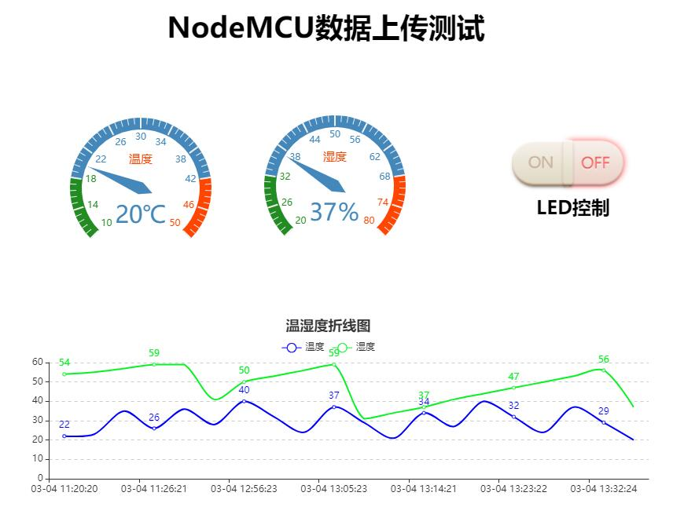
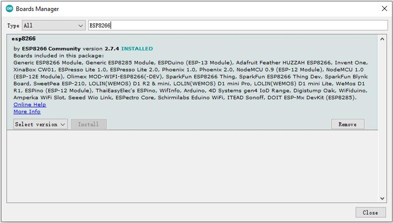
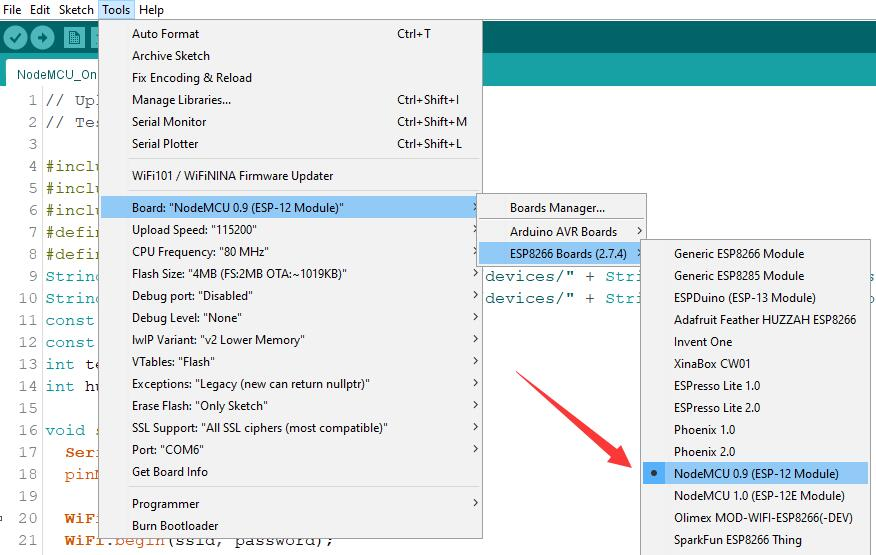
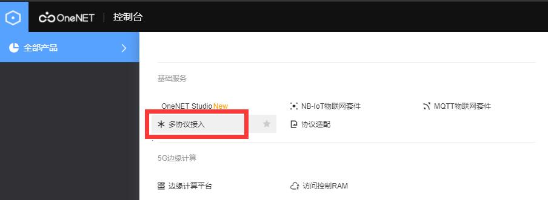
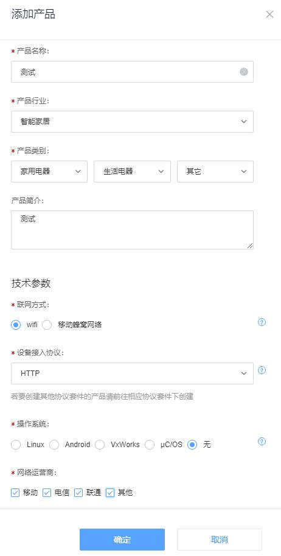
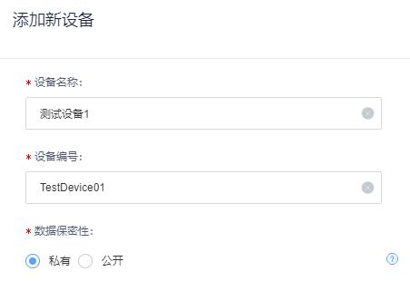
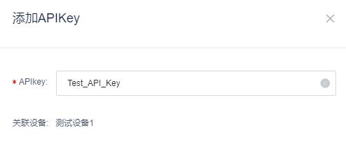
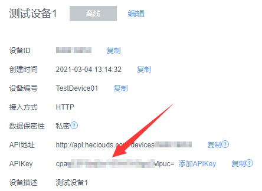
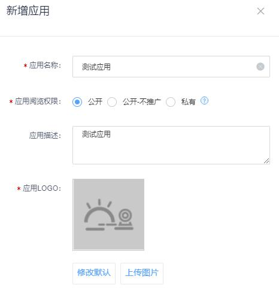
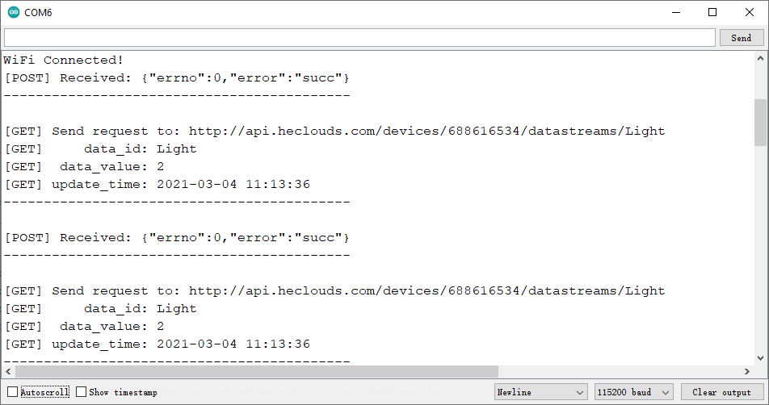

# README

> 功能：NodeMCU上传温湿度数据到OneNET平台，OneNET控制NodeMCU板载LED
>
> 思路：NodeMCU先连接上WiFi，使用HTTP协议与OneNET互传数据。主要编写了三个函数，ESP8266_GET函数使用GET方式，从云平台获取LED信息，实现由云平台控制LED开关；ESP8266_POST函数使用POST方式，向云平台发送模拟的温湿度数据（因为没找到温湿度传感器）；Json_Analysis_GET函数用来解析GET请求传回的Json数据。



## 1. NodeMCU初始化

在文件->首选项->额外的开发板管理URL里面，粘贴下面的网址
```html
http://arduino.esp8266.com/stable/package_esp8266com_index.json
```
在工具->开发板->开发板管理里面，查找ESP8266并下载相应的包



点击工具->开发板->ESP8266开发板，选择NodeMCU 0.9(ESP-12 Module)



## 2. OneNET初始化

注册OneNET账号，进入旧版控制台页面

```html
https://open.iot.10086.cn/develop/global/product/#/console
```

在左侧找到全部产品，在基础服务里选择“多协议接入”



选择HTTP协议并添加新产品



进入刚刚创建的产品，新建一个设备



查看该设备的详情，在详情页面为其添加API_Key



添加完成后，会得到相应的API_Key值



之后我们手动添加一个数据流模板，数据流模板是当前产品的每个设备都会有的数据流。

点击数据流展示->数据流模板管理->添加数据流模板，添加一个名称为Light的模板，表示由NodeMCU控制的LED灯


接下来添加相关应用，在控制台页面左侧找到应用管理->添加应用，添加一个应用以便测试



点击该应用并点击编辑应用，需要注意，将switch组件的开关值设置为：开值为1，关值为2

编辑完成后，记得要点击右上角的保存按钮


## 3. 编写NodeMCU程序

直接复制以下代码到Arduino IDE中，注意要将代码中宏定义的xxxxxxxxx部分，改成自己对应的值

`DEVICE_ID`是你的设备ID，`API_Key`是对应的APIKey值，`ssid`和`password`是WiFi名称和密码

```c
// Upload data using OneNET + NodeMCU
// Test By ZhangHoujin 2021.03.04

#include <ESP8266WiFi.h>
#include <ESP8266HTTPClient.h>
#include <ArduinoJson.h>
#define DEVICE_ID "xxxxxxxxxxxxxx"
#define  API_Key  "xxxxxxxxxxxxxx"
String   GET_URL = "http://api.heclouds.com/devices/" + String(DEVICE_ID) + "/datastreams/Light";
String  POST_URL = "http://api.heclouds.com/devices/" + String(DEVICE_ID) + "/datapoints";
const char* ssid = "xxxxxxxxxxxx";
const char* password = "xxxxxxxx";
int temp = 20;
int humi = 30;

void setup(){
  Serial.begin(115200);
  pinMode(LED_BUILTIN, OUTPUT);

  WiFi.mode(WIFI_STA);
  WiFi.begin(ssid, password);

  while(WiFi.status() != WL_CONNECTED){
    delay(1000);
    Serial.print(".");        // Waiting for connection
  }
  Serial.println("\nWiFi Connected!");
}

void loop(){
  if((WiFi.status() == WL_CONNECTED)){
    if(++temp>40){temp=20;}   // Data for simulation
    if(++humi>60){humi=30;}
    ESP8266_POST();
    delay(3000);  // 3s
    ESP8266_GET();
  }
  else{
    Serial.println("[ERROR] WiFi Disconnected!");
  }
  delay(2000);
}

void ESP8266_GET(){
  HTTPClient httpClient;
  httpClient.begin(GET_URL);
  //Serial.print("GET_URL: "); Serial.println(GET_URL);

  httpClient.setReuse(true);    // Keep-Alive
  httpClient.addHeader("api-key", API_Key);
  
  int httpCode = httpClient.GET();
  Serial.println("[GET] Send request to: " + String(GET_URL));

  if(httpCode == HTTP_CODE_OK){
    String responsePayload = httpClient.getString();
    Json_Analysis_GET(responsePayload);
    //Serial.println("[GET] Server Response: " + responsePayload);
    Serial.println("-------------------------------------------\n");
  }
  else{
    Serial.println("Server Respose Code：" + httpCode);
  }
}

void ESP8266_POST(){
  WiFiClient client;
  HTTPClient httpClient;
  String pay = "{\"datastreams\":[{\"id\":\"Temperature\",\"datapoints\":[{\"value\":" + String(temp) + "}]},{\"id\": \"Humidity\",\"datapoints\":[{\"value\":" + String(humi) + "}]}]}";
  //Serial.println("pay: " + pay);

  httpClient.begin(client, POST_URL);
  httpClient.setReuse(true);  //Keep-Alive
  httpClient.addHeader("api-key", API_Key);
  //Serial.print("[POST] begin\n");
  int httpCode = httpClient.POST(pay);
  //Serial.print("[POST] .....\n");

  if(httpCode > 0){
    //Serial.printf("[POST] Code: %d\n", httpCode);
    if(httpCode == HTTP_CODE_OK){
      const String& payload = httpClient.getString();
      Serial.println("[POST] Received: " + payload);
      Serial.println("-------------------------------------------\n");
    }
  }
  else{
    Serial.printf("[ERROR] Failed, POST error: %s\n", httpClient.errorToString(httpCode).c_str());
  }
}

void Json_Analysis_GET(String input){
  StaticJsonDocument<256> doc;
  DeserializationError error = deserializeJson(doc, input);
  
  if (error) {
    Serial.print(F("deserializeJson() failed: "));
    Serial.println(error.f_str());
    return;
  }
  
  int errno = doc["errno"]; // 0
  JsonObject data = doc["data"];
  const char* data_update_at = data["update_at"]; // "2021-03-04 10:40:32"
  const char* data_unit = data["unit"]; // ""
  const char* data_id = data["id"]; // "Light"
  const char* data_unit_symbol = data["unit_symbol"]; // ""
  int data_current_value = data["current_value"]; // 1
  const char* succ = doc["error"]; // "succ"
  
  Serial.println("[GET]     data_id: " + String(data_id));
  Serial.println("[GET]  data_value: " + String(data_current_value));
  Serial.println("[GET] update_time: " + String(data_update_at));
  //Serial.println("[GET] create_time: " + String(data_create_time));
  if(succ == "succ"){
    Serial.println("[GET] OK!");
  }
  if(data_current_value == 1){
    digitalWrite(LED_BUILTIN, LOW);   // LED On
  }
  else{
    digitalWrite(LED_BUILTIN, HIGH);  // LED Off
  }
}
```

## 4. 测试说明

运行代码，可以在ArduinoIDE的串口监视器中看到GET和POST的请求信息。



在OneNET的应用管理->应用详情页面，找到该应用的“发布链接”，进入该链接可以看到实时上传的数据，也可以对NodeMCU板载的LED进行开关控制。

OneNET平台数据刷新最小间隔时间为3秒，所以数据会有几秒钟的延时。
